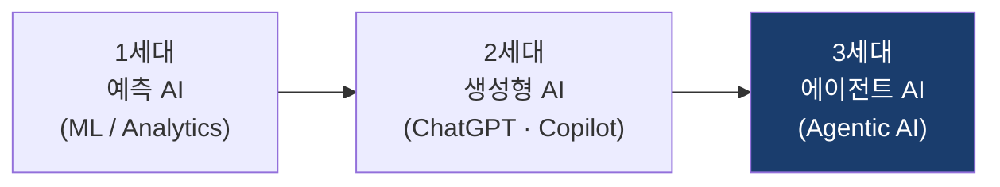
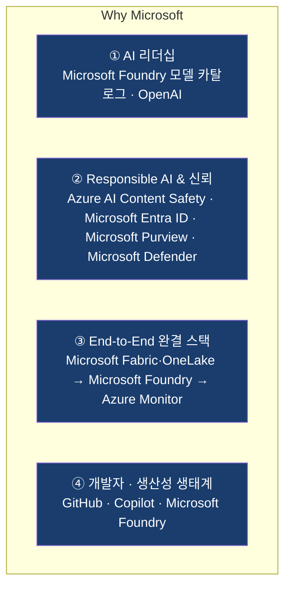
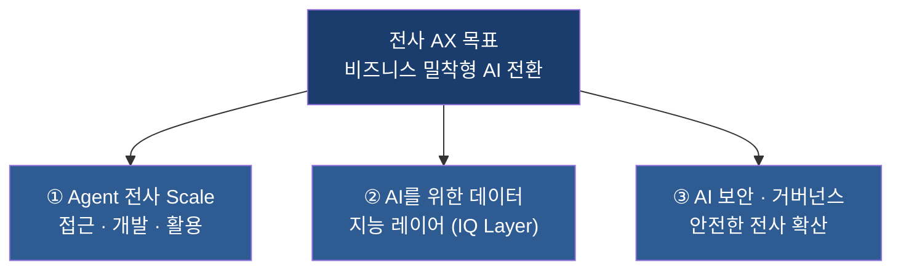
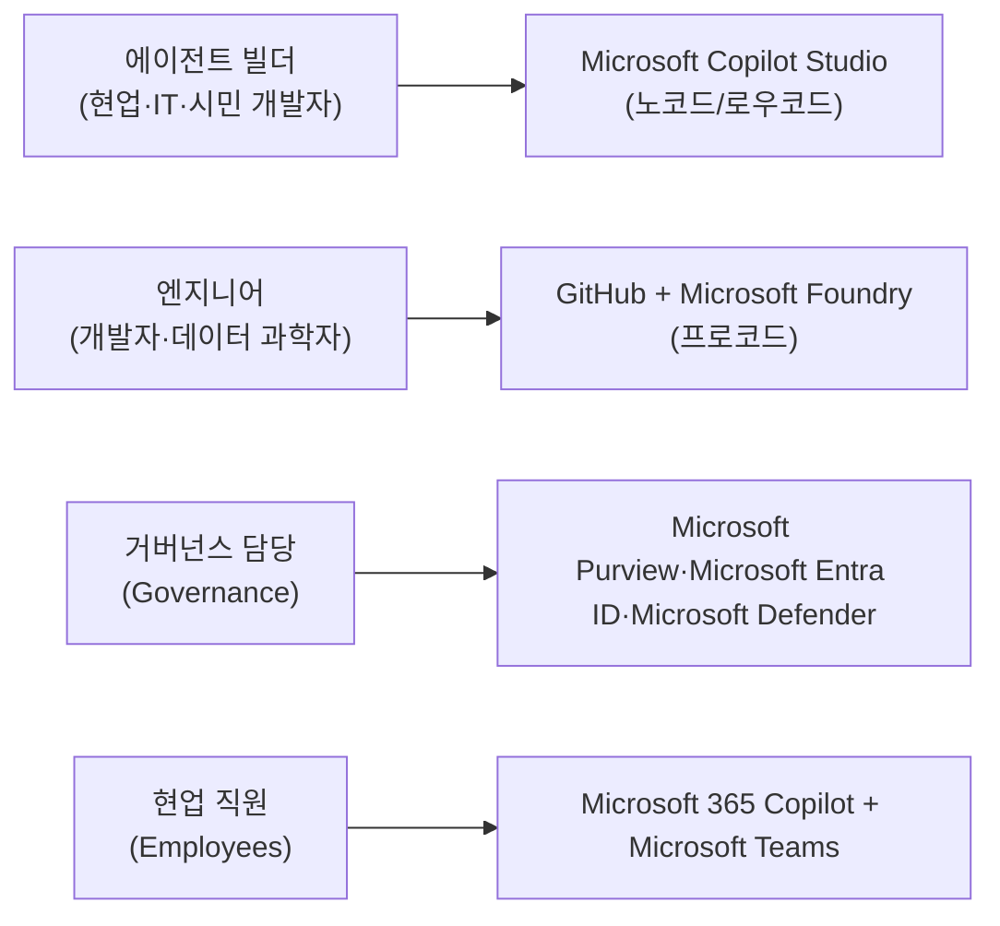
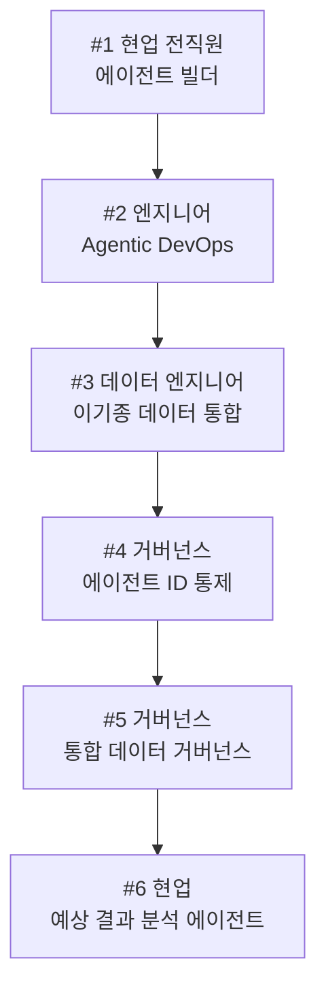
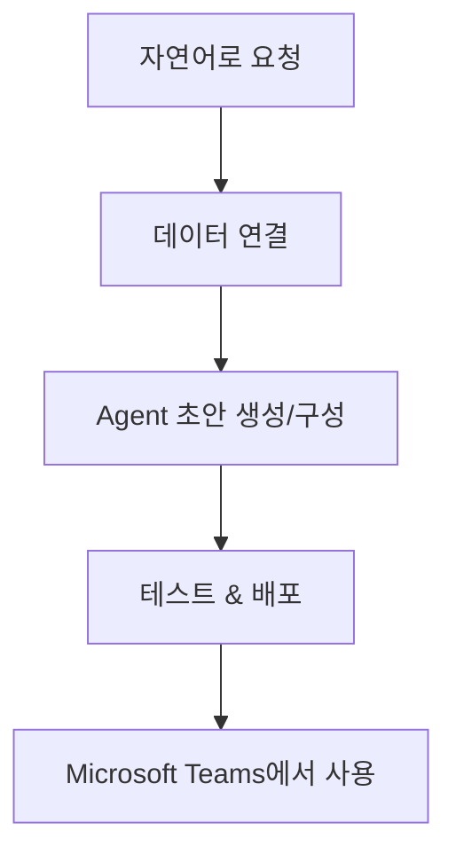
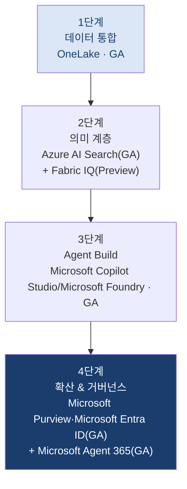
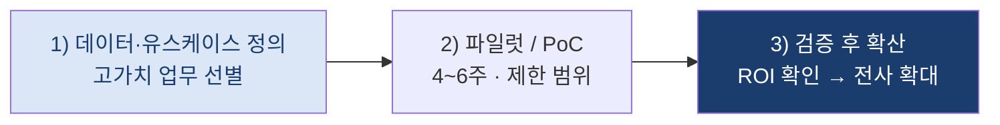
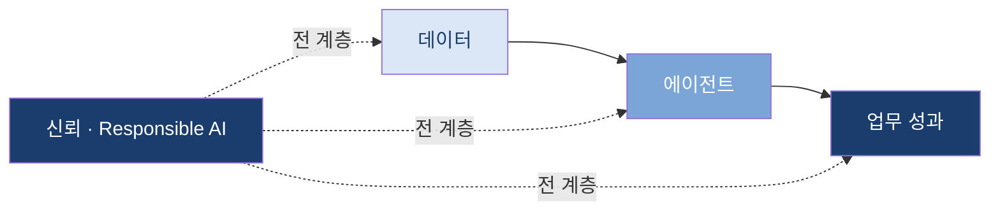

# Why Build AI on Azure?

## 데이터에서 에이전트까지 — Azure 위에서 만드는 신뢰할 수 있는 Enterprise AI Platform

> 📖 **읽는 데 걸리는 시간:** 약 **40분** &nbsp;|&nbsp; 🗂️ **버전:** v1.0

**이 자료의 3줄 요약**
1. **Azure를 택하는 이유는 모델이 아니라 운영 통제입니다** — 보안·거버넌스·비용을 일관된 정책으로 관리합니다.
2. **기존 데이터·클라우드 투자를 그대로 살려 연결합니다** — 이전(migration)이 아니라 연결(connect)로 시작합니다.
3. **4~6주 파일럿으로 처리시간·비용·리스크 KPI를 먼저 검증합니다** — 성과가 확인된 유스케이스부터 확장합니다.

---

## 목차 (Contents)

**Part 1 — 왜 지금, 왜 Azure인가 (신뢰)**
- [**1. 왜 지금 AI인가** — 에이전트 시대의 전환](#s1)
- [**2. 고객이 마주한 현실적 과제**](#s2)
- [**3. 왜 Microsoft인가** — 4대 신뢰 근거](#s3)
- [**4. 우리의 관점** — 제품이 아니라 비즈니스 성과](#s4)

**Part 2 — AX 전략 (가치)**
- [**5. AX 3대 전략** — 에이전트 = 디지털 직원](#s5)

**Part 3 — Enterprise AI Platform (근거)**
- [**6. 무엇이 갖춰져야 하는가** — 제품 이름 없이](#s6)
- [**7. 그래서 Microsoft는** — 같은 그림, 채워진 버전](#s7)

**Part 4 — 실현 (다음 단계)**
- [**8. 역할별 여정**](#s12)
- [**9. 역할별 활용 시나리오**](#s13)
- [**10. 로드맵 · 다음 단계**](#s14)
- [**11. 함께 생각해볼 질문**](#s15)

---

<a id="s1"></a>
# 1. 왜 지금 AI인가

---

## AI 패러다임의 전환 — 예측에서 실행으로



- **1세대 (예측 AI):** 데이터로 미래를 예측 — 수요 예측, 이탈 예측
- **2세대 (생성형 AI):** 콘텐츠를 생성 — 문서 요약, 코드 작성, 대화
- **3세대 (에이전트 AI):** **스스로 판단하고 업무를 실행** — 목표를 주면 도구를 사용해 작업을 완수

**지금 기업이 준비해야 할 것은 대화형 챗봇이 아니라, 업무를 수행하는 디지털 인력(Digital Workforce)입니다.**

---

### 그래서 실제로 무엇이 바뀌는가

| 구분 | 기존 (사람 중심) | 에이전트 AI (Human + Agent) |
|------|------------------|------------------------------|
| 업무 방식 | 사람이 시스템을 조작 | 에이전트가 시스템을 대신 실행 |
| 데이터 활용 | 리포트를 사람이 해석 | 에이전트가 데이터를 이해하고 행동 |
| 확장성 | 인력 채용에 비례 | 재사용 가능한 패턴으로 빠르게 확장 |
| 24/7 운영 | 어려움 | 상시 가능 |

**핵심 질문:** 이 에이전트들을 어디에, 어떻게, **안전하게** 운영할 것인가?
→ 이 문서는 바로 이 질문에 대한 답을 정리합니다.

**왜 지금인가 — 미루면 벌어지는 격차**
- **경쟁 격차:** 먼저 도입한 조직은 처리속도·단가에서 앞서고, 그 격차는 시간이 갈수록 벌어집니다.
- **생산성 격차:** 반복 업무가 그대로 남으면 인력은 고부가 업무로 이동하지 못합니다.
- **Shadow AI 리스크:** 통제 없이 개인이 외부 AI에 사내 데이터를 넣는 사용이 이미 번지고 있습니다.
- **규제 리스크:** 거버넌스 없이 확산되면, 나중에 되돌리는 비용이 지금 준비하는 비용보다 큽니다.

→ **이미 Microsoft 365·GitHub·Microsoft Fabric을 쓰고 있다면, '지금' 시작하기 가장 가까운 곳은 그 위에 얹히는 Azure입니다.**

---

<a id="s2"></a>
## 2. 고객이 마주한 현실적 과제

AI를 도입하려는 대부분의 기업이 공통으로 부딪히는 6가지 벽:

- 🔸 **데이터가 흩어져 있다** — Snowflake, SAP, Salesforce, 오브젝트 스토리지에 파편화
- 🔸 **AI가 우리 비즈니스를 이해하지 못한다** — 원본 테이블만으로는 의미를 알 수 없음
- 🔸 **에이전트를 만드는 방법이 제각각이다** — 표준화된 개발/배포 체계 부재
- 🔸 **거버넌스가 없다** — 누가 어떤 데이터에 접근하는지 통제 불가
- 🔸 **보안·규정 준수 리스크** — AI가 민감 데이터를 유출할 위험
- 🔸 **만들어도 현업이 쓰지 않는다** — 별도 도구를 열어야 하면 바쁜 일상에서 밀려남

**Microsoft의 접근:** 이 6가지를 개별 도구의 조합이 아니라, 신뢰할 수 있는 하나의 플랫폼으로 풀어가는 것이 Microsoft의 방식입니다. **이어지는 [§3](#s3)에서 각 벽에 Azure가 어떻게 답하는지** 근거를 정리합니다.

---

<a id="s3"></a>
# 3. 왜 Microsoft인가

---

## Microsoft를 신뢰할 수 있는 4가지 이유



AI 파트너를 고를 때 가장 중요한 것은 **믿고 맡길 수 있는 파트너인가** 입니다.

> **이 네 가지가 특히 강한 이유** — 이미 Microsoft 365·Microsoft Entra ID·GitHub·Microsoft Fabric을 쓰는 조직에겐, 새로 만드는 게 아니라 *'쓰던 것'* 위에 안전하게 얹힙니다.

---


## ① AI 리더십 — 최신 모델부터 실사용까지

- **Frontier 모델에 대한 접근** — OpenAI(GPT 계열), 그리고 오픈소스·자체 모델까지
  **Microsoft Foundry 모델 카탈로그**에서 선택

- **모델 선택의 자유** — 특정 모델에 종속되지 않고 업무별 최적 모델 사용
- **검증된 실사용 생태계** — Microsoft 365 Copilot, GitHub Copilot 등 이미 전 세계가 사용하는 Copilot
- **책임 있는 규모의 운영** — 글로벌 Azure 리전에서 엔터프라이즈 SLA로 제공

---

## ② Responsible AI & 엔터프라이즈 신뢰

AI 도입의 가장 큰 장벽은 기술이 아니라 **신뢰**입니다.

| 신뢰 요소 | Microsoft의 접근 | 관련 Azure 서비스 |
|-----------|------------------|-------------------|
| **데이터 주권** | 고객 입력·출력의 기반 모델 학습 미사용 원칙(서비스·모델별 약관 확인) | Azure OpenAI · Microsoft Foundry |
| **보안** | 제로 트러스트, 위협 탐지 내장 | Microsoft Entra ID · Microsoft Defender |
| **규정 준수** | 데이터 분류·DLP·감사 | Microsoft Purview |
| **안전한 AI** | 콘텐츠 안전·프롬프트 보호 | Azure AI Content Safety |
| **투명성** | Responsible AI 표준·거버넌스 | Microsoft Foundry(평가·추적) |

---


## 일반론이 아니라 — 어디서 구축·운영할 것인가 (6가지 판단 기준)

"왜 Azure인가"를 **구매 검토 체크리스트**로 바꿔 놓았습니다. 어느 클라우드를 검토하든 같은 질문을 던질 수 있습니다.

| 판단 기준 | 왜 중요한가 · 고객 관점 | Azure에서 어떻게 |
|----------|----------------------|-----------------|
| **데이터 주권** | 리전 밖으로 나가면 규제 리스크 | 한국 리전 우선 설계 · 테넌트 격리 · **입력·출력을 기반 모델 학습에 미사용** *(약관은 서비스·모델별 확인)* |
| **모델 운영** | 특정 모델에 종속되면 비용·성능을 못 바꿈 | 모델 카탈로그에서 프론티어(OpenAI)·오픈소스·산업별 모델을 **골라 바꿔 사용** |
| **기존 스택 활용** | 이관을 전제하면 시작 자체가 늦어짐 | 원본을 옮기지 않고 **연결부터** 시작 · 쓰던 것 위에 얹힘 |
| **보안 경계** | AI가 사내 데이터에 닿는 경로 | 프라이빗 엔드포인트 · 가상 네트워크 · 망분리 |
| **거버넌스 · 감사** | 누가·무엇을·언제 접근했는지 | 신원 · 데이터 · 위협 · 에이전트를 **한 정책으로** 통제 |
| **비용 관측** | 토큰·라이선스 비용의 가시성 | 사용량·비용을 한곳에서 관측 |

**Why Azure?의 답은 개별 기능이 아닙니다.** 각각을 잘하는 제품은 시장에 많습니다. 문제는 여섯 가지를 **한 기반 위에서 일관되게** 통제할 수 있는가입니다.

> 각 기준을 실제로 어떤 서비스가 맡는지는 [§7](#s7)에서 계층별로 다룹니다. 여기서는 **무엇을 물어야 하는지**까지만 정리합니다.

<a id="s4"></a>

## 4. 우리의 관점 — 제품이 아니라 비즈니스 성과

**여러분의 어떤 업무·비즈니스 과제를 AI로 해결할 수 있을까요?**
우리의 출발점은 언제나 이 질문입니다 — 기술이 아니라 여러분의 성과에서 시작합니다.

**Microsoft의 접근 3원칙:**
1. **비즈니스 우선** — 기술이 아니라 성과(매출·비용·경험)에서 출발
2. **작게 시작, 빠르게 확장** — 고가치 파일럿 → 전사 확산
3. **신뢰를 먼저** — 보안·거버넌스를 처음부터 함께 설계

**기존 투자는 그대로 둡니다.** 이미 보유한 데이터 플랫폼·클라우드·SaaS를 **그대로 활용해 연결**하는 것부터 시작합니다. 핵심은 이전(migration)이 아니라 **AI가 쓸 수 있게 연결(connect)** 하는 것이며, 비용·성능은 파일럿에서 실제로 검증합니다.

- **이전하지 않아도 되는 경우:** 원본을 그대로 두고 가상 연결(Shortcut) — 대부분의 시작점
- **일부만 복제하는 경우:** 실시간성·품질이 중요한 데이터만 선별 복제
- **장기 통합이 맞는 경우:** 데이터 현대화를 함께 추진할 때 점진적 통합

이어지는 내용은 그것을 어떻게 실현하는가에 대한 **참고 청사진**입니다.

#### 성과와 ROI를 보는 틀 (예시 KPI)

파일럿은 **실제 숫자로 검증**합니다. 아래는 업무에 따라 함께 정의할 **KPI 후보**이며(회사별 목표치는 파일럿에서 확정), 실 수치는 넣지 않았습니다.

| 성과 축 | 예시 지표 | 어떻게 측정하나 |
|---------|-----------|-----------------|
| **비용 절감** | 반복 업무 처리 인시(人時)·외주비 | 도입 전후 처리 건당 시간·비용 비교 |
| **처리시간 단축** | 문서·문의·리포트 리드타임 | 요청→완료 소요시간(중앙값) |
| **리스크 감소** | 규정 위반·데이터 유출 건, 감사 준비 시간 | Microsoft Purview/Microsoft Defender 감사 로그 기반 |
| **매출 기회** | 응대 속도·전환율·상담 처리량 | CRM·상담 데이터 연계 |
| **파일럿 성공 기준** | 정확도·채택률·ROI 임계값 | 사전 합의한 목표치 충족 여부 |

핵심: 얼마나 좋아지는가는 **파일럿에서 여러분의 데이터로** 증명합니다 — 가짜 숫자 대신 검증 가능한 기준으로.

**ROI를 보는 틀 (정확한 금액은 파일럿에서 산정)**

```
순가치 = (절감된 시간 × 인건비) + (오류·리스크 감소) + (매출·기회 증가)
        − (라이선스 + 사용량 비용 + 도입·운영 비용)
```

작게 시작해 **실제 사용량 기반 단가를 먼저 검증**하고, ROI가 확인된 유스케이스부터 확대합니다. 목표는 *AI에 얼마 쓰나*가 아니라 **1원을 넣으면 몇 원이 돌아오나**입니다.

### 자주 묻는 4가지

| 질문 | 짧은 답 |
|------|---------|
| **데이터를 다 옮겨야 하나요?** | 아니요. 원본을 둔 채 **가상 연결(Shortcut)**로 시작하고, 필요한 것만 선별 복제합니다. |
| **Preview 기능에 의존하나요?** | 아니요. **GA 서비스로 시작**하고 Preview(IQ 계열 등)는 로드맵으로 분리합니다. |
| **보안팀 승인은 어떻게 받나요?** | Microsoft Entra ID·Microsoft Purview·Microsoft Defender로 **접근·정책·감사**를 처음부터 함께 설계해 승인 근거를 만듭니다. |
| **ROI는 언제 확인하나요?** | 첫 파일럿에서 **사전 합의한 KPI**로 검증합니다 — 확장은 그 뒤에 결정합니다. |

---

<a id="s5"></a>
# 5. AX 3대 전략과 Microsoft의 제언

---

## AX(AI Transformation)를 떠받치는 3대 전략

기업의 전사 AI 전환은 다음 3가지 축 위에서 완성됩니다.



**Microsoft 제언:** 차별화되지 않는 기반 구축에 인력을 묶어두기보다, **Azure 기반의 통합 Enterprise AI Platform**을 활용해 매출·비용·리스크에 직접 연결되는 유스케이스에 집중하세요.

---

## 에이전트 = 디지털 직원 관점으로 이해하기

이 플랫폼의 핵심 관점: **에이전트를 사람 직원처럼 채용·교육·운영·감사**한다. 단, 최종 책임과 권한은 사람에게 있으며, 에이전트는 그 통제·감사 체계 안에서 운영됩니다.

| 전략 축 | 하는 일 | 직원에 비유하면 |
|---------|---------|-----------------|
| **① Agent 전사 Scale** | 전직원이 에이전트를 직접 만들고 활용 | 직원이 **AI의 팀장** 역할 수행 |
| **② 데이터 IQ Layer** | 비즈니스 맥락을 이해한 자율 업무 수행 | **비즈니스를 아는 숙련된 직원** |
| **③ 보안·거버넌스** | 에이전트가 제대로 일하는지 관리 | **에이전트의 HR 시스템** |

- **채용(개발):** Agent Build 계층에서 에이전트를 채용
- **교육(그라운딩):** Ontology(IQ)로 회사 지식을 학습
- **근무(실행):** Agents 계층에서 실제 업무 수행
- **인사관리(거버넌스):** Microsoft Agent 365 *[GA · 2026.5]* + Microsoft Entra ID + Microsoft Purview + Microsoft Defender로 관리·감사

---

> 이 세 축이 **실제 아키텍처에서 어느 자리에 놓이는지**는 [§6](#s6)·[§7](#s7)에서 계층으로 봅니다 —
> ①은 팩토리·에이전트·경험 계층, ②는 레이크·온톨로지 계층, ③은 전 계층을 관통하는 세로축입니다.


---

<a id="s6"></a>
<a id="two-pillars"></a>
<a id="s6"></a>

# 6. 무엇이 갖춰져야 하는가 — 제품 이름 없이

Part 3은 두 부분으로 나뉩니다. **앞쪽 절반에는 제품 이름이 한 번도 나오지 않습니다.** 전사에서 AI를 쓰려면 어떤 요소가 필요한지, 그 요소가 없으면 무엇이 막히는지만 이야기합니다. 뒤쪽 절반에서 같은 그림을 다시 꺼내, 그 빈칸을 Microsoft가 어떻게 채우는지 봅니다.

순서를 이렇게 잡은 이유는 분명합니다. 제품을 먼저 보면 "이 제품이 필요한가"를 묻게 되지만, 요구사항을 먼저 보면 **"우리는 이 칸을 어떻게 채우고 있나"**를 묻게 됩니다. 후자가 훨씬 생산적인 질문입니다.

## 전사로 확산하려면 무엇이 갖춰져야 하는가

[§2](#s2)에서 본 여섯 가지 벽은 모델의 문제가 아니었습니다. 에이전트를 **만들고 · 쓰고 · 통제하는 기반**이 없어서 생긴 문제였습니다. 이를 요구사항의 언어로 바꾸면 여섯 가지가 됩니다.

| 증상 | 그래서 필요한 것 |
|------|-----------------|
| 부서마다 숫자가 다르고 단일 원천이 없다 | 이기종 시스템을 **옮기지 않고** 하나로 잇는 계층 |
| "매출"이 무엇인지 회사 기준을 AI가 모른다 | 데이터를 **비즈니스 의미**로 바꾸는 계층 |
| 개발자에게만 맡기면 수요를 못 따라간다 | **현업과 개발자가 각자의 방식**으로 만드는 수단 |
| 새 도구를 열어야 하면 업무에서 밀려난다 | **이미 일하는 곳**에 배포되는 접점 |
| 무엇이 도는지 모르면 확산될수록 위험하다 | 에이전트를 **소프트웨어처럼** 개발·운영하는 체계 |
| 통제되지 않으면 확산 승인이 안 난다 | 전 계층을 **하나의 정책**으로 통제하는 거버넌스 |

> 여섯 항목 모두 "어떤 제품이 없다"가 아니라 **"어떤 기능이 없다"**로 적혀 있습니다. 조직마다 이미 채워둔 칸이 다르기 때문입니다.

## 필요한 플랫폼의 모습 — 6계층과 두 세로축

위 요구사항을 위치로 배치하면 하나의 그림이 됩니다. **가로 6계층은 아래에서 위로** 읽습니다.

| 계층 | 이 계층이 하는 일 | 없으면 생기는 일 | 충족 기준 |
|------|------------------|-----------------|----------|
| **AI 경험** | 일하는 곳에서 바로 쓰게 한다 | 만들어도 안 쓴다 | 기존 협업 도구 안에서 열린다 |
| **에이전트 · AI 앱** | 개인 → 팀 → 전사로 넓힌다 | 개인 실험에서 멈춘다 | 업무 단위로 배포·공유된다 |
| **에이전트 팩토리** | 현업과 개발자가 각자 만든다 | 개발 대기열이 병목이 된다 | Low-Code · Pro-Code 양쪽 지원 |
| **온톨로지** | 데이터에 회사의 의미를 입힌다 | 근거 없는 답변 · 환각 | 용어·지표가 회사 기준대로 해석 |
| **레이크** | 이기종 데이터를 하나로 잇는다 | 부서마다 숫자가 다르다 | 복제 없이 단일 원천으로 조회 |
| **기존 데이터 · 시스템** | 이미 있는 자산을 그대로 쓴다 | 이관 비용·리스크가 발목 | 원본을 옮기지 않아도 된다 |

**순서에 의존성이 있습니다.** 레이크 없이 온톨로지를 만들 수 없고, 온톨로지 없이 만든 에이전트는 근거를 갖지 못합니다. 위층부터 시작하고 싶은 유혹이 크지만 — 경험 계층은 눈에 보이고 데모하기 쉬우므로 — 아래가 비어 있으면 그 데모는 확산되지 않습니다.

## 세로 두 축 — 확산 단계에서만 드러나는 것

두 축은 **6계층 전체를 관통**합니다. 특정 계층의 기능이 아니라 모든 계층에 동시에 적용돼야 하는 성질의 것입니다. 그리고 에이전트가 한두 개일 때는 거의 보이지 않다가, 수십 개가 되는 순간 병목이 됩니다.

| 왼쪽 축 — 에이전트를 소프트웨어로 다루는 체계 | 오른쪽 축 — 전 계층을 하나의 정책으로 묶는 통제 |
|---|---|
| 버전과 이력이 남아야 한다 | 에이전트를 관리 대상으로 본다 (목록·소유자·수명주기) |
| 배포가 자동화돼야 한다 | 데이터 취급 규칙이 계층을 넘어 일관돼야 한다 |
| 만드는 속도를 올려야 한다 | 신원과 권한이 하나여야 한다 |
| 취약점을 미리 잡아야 한다 | 위협을 탐지할 수 있어야 한다 |

> **신뢰 없이는 확산 없습니다.** 보안·법무·감사 조직이 승인하지 못하면 좋은 에이전트를 만들어도 전사로 열지 못합니다. 두 축은 비용이 아니라 **확산 속도를 결정하는 변수**입니다.

---

<a id="s7"></a>

# 7. 그래서 Microsoft는 — 같은 그림, 채워진 버전

앞의 그림과 **완전히 같은 자리, 같은 크기**입니다. 바뀐 것은 칸 안의 이름뿐입니다. 여기서 봐야 할 것은 개별 제품의 기능이 아니라 **빈칸이 남아 있지 않다는 사실**입니다.

여러 벤더를 조합해도 이 그림을 채울 수는 있습니다. 다만 그때는 계층 사이를 잇는 일, 신원을 맞추는 일, 거버넌스를 일관되게 거는 일이 **전부 고객의 몫**으로 남습니다.

## 계층 1·2 — 기존 시스템을 그대로 두고 하나로 잇기

**가장 중요한 메시지는 왼쪽입니다.** Snowflake가 AWS에 있어도, SAP가 온프레미스에 있어도 됩니다. 데이터 이관은 비용과 리스크가 크고, 그것 때문에 AI 프로젝트가 시작도 못 하는 경우가 많습니다.

| 요구사항 | 맡는 것 | 선택 기준 |
|---------|--------|----------|
| 데이터 복제 없이 연결 | **OneLake 숏컷(Shortcut)** | 최신성이 덜 중요하고 원본 부하를 피하고 싶을 때 |
| 준 실시간 복제 및 동기화 | **Fabric 미러링(Mirroring)** | 조회가 빈번하고 지연을 줄여야 할 때 |
| ETL 및 파이프라인 | **Fabric Data Factory** | 원본을 그대로 쓰기 어려워 정제·가공이 필요할 때 |

**💡 비즈니스 가치:** 데이터 사일로 → **하나의 신뢰 가능한 원천**. 이관이 전제 조건이 아닙니다.

## 계층 3 — 데이터를 회사의 의미로 바꾸는 곳

**이 계층이 Part 3 전체에서 가장 중요합니다.** 모델 성능은 시간이 지나면 평준화되고 어느 클라우드에서나 비슷한 모델을 쓸 수 있게 됩니다. 그러나 *우리 회사의 데이터가 무엇을 뜻하는지, 우리가 어떻게 일하는지*는 우리만 정의할 수 있습니다.

| 요구사항 | 맡는 것 | 무엇을 아는가 | 없으면 |
|---------|--------|-------------|--------|
| 데이터레이크 + 시맨틱 모델 | **Fabric IQ** *[Preview · 확인 필요]* | "매출"이 어떤 테이블·조인·규칙인지 | 지표가 부서마다 다르게 해석 |
| 온톨로지 기반 비즈니스 구조 | **Work IQ** *[Preview · 확인 필요]* | 누가·언제·어떤 문서로 일하는지 | 실무 맥락 없는 일반론 답변 |
| 기업 데이터 + 온톨로지 컨텍스트 | **Foundry IQ** *[일부 GA · 확인 필요]* | 에이전트가 참조할 지식 인덱스 | 근거 없는 답변 · 환각 |

> ⚠️ **오늘 GA로 시작하는 법** — 세 IQ를 기다릴 필요가 없습니다. **Azure AI Search**(GA)와 자체 시맨틱·메타데이터 모델링만으로 의미 계층을 지금 구성할 수 있고, IQ는 GA·한국 리전이 확정되면 **단계적으로 보완**합니다. Preview에 의존하는 제안은 승인되지 않습니다.

이 계층을 건너뛰면 **"데이터는 다 모았는데 AI가 여전히 엉뚱한 답을 한다"**가 됩니다. 레이크 구축까지는 예산이 잡히는데 의미 계층은 눈에 보이지 않아 빠지기 때문에, 가장 흔한 실패 패턴입니다.

## 계층 4 — 현업과 개발자가 각자의 방식으로 만든다

에이전트는 **모델만으로 만들어지지 않습니다.** 회사 지식(계층 3) + 모델 + 도구·커넥터가 함께 있어야 답만 하는 챗봇이 아니라 **업무를 끝내는 에이전트**가 됩니다.

| 요구사항 | 맡는 것 | 무엇을 해결하는가 |
|---------|--------|-----------------|
| Low-Code / 현업 사용자 개발 | **Microsoft Copilot Studio** | 현업이 직접 만들어 **개발 대기열 병목**을 없앰 |
| Pro-Code / 고급 사용자 개발 | **Microsoft Foundry** | 모델 선택·평가·파인튜닝으로 **프로덕션 에이전트** 제작 |

**두 도구를 모두 두는 것이 핵심입니다.** 개발자용만 있으면 확산 속도가 조직의 개발 역량에 묶이고, 현업용만 있으면 핵심 업무를 감당하지 못합니다. 선택 기준은 업무 중요도가 아니라 **만드는 사람**입니다.

두 도구는 **서로 호출**합니다. 현업이 만든 에이전트가 개발자가 만든 에이전트를 불러 멀티에이전트로 확장됩니다. 따로 도입하면 이 연결이 끊깁니다.

## 계층 5·6 — 개인에서 전사로, 일하는 곳에서 바로

"만드는 것"과 "쓰이게 하는 것"은 다른 문제입니다. 좋은 에이전트를 만들어도 별도 사이트에 접속해야 한다면 바쁜 현업은 결국 쓰지 않습니다.

| 계층 5 — 확산 경로 | 범위 | 예시 |
|-----------------|------|------|
| **Microsoft 365 Copilot** | 개인 생산성 | 메일 요약, 문서 작성 |
| **Workgroup Agents** | 팀 · 조직 단위 | 프로젝트 지원, 온보딩 |
| **Business Agents** | 핵심 비즈니스 · 매출 | 주문 처리, 재무 마감 |

**작게 시작해 크게 확장합니다.** 처음부터 핵심 업무 에이전트를 만들려 하면 데이터·권한·검증 요구가 한꺼번에 몰립니다. 개인 생산성에서 시작하면 몇 주 안에 성과를 보여줄 수 있고, 그 성과가 다음 단계 예산과 승인을 끌어옵니다.

**계층 6은 접점입니다.** Microsoft 365 Copilot · Microsoft Teams가 단일 진입점이 되고, 전직원이 **에이전트 스토어**에서 필요한 것을 찾아 바로 씁니다. 새 도구를 열게 하지 않는다는 점이 채택 장벽을 낮춥니다.

## 세로 두 축 — 개발 체계와 거버넌스를 채우는 것

| 왼쪽 축 요구사항 | 맡는 것 | 오른쪽 축 요구사항 | 맡는 것 |
|---|---|---|---|
| 버전과 이력 | **GitHub Enterprise** | 에이전트 관제 | **Microsoft Agent 365** *[GA 2026.5 · 일부 Preview]* |
| 배포 자동화 | **GitHub Actions** | 데이터 거버넌스 | **Microsoft Purview** |
| 제작 속도 | **GitHub Copilot** | 신원 · 접근통제 | **Microsoft Entra ID** |
| 취약점 사전 차단 | **GitHub Code Security** · **Secret Protection** | 위협 탐지 | **Microsoft Defender** |

왼쪽은 **이미 개발 조직이 쓰고 있는 도구 그대로**입니다. 에이전트를 위해 새 개발 체계를 도입하는 것이 아니라, 소프트웨어를 다루던 방식을 에이전트에도 적용하는 것입니다.

오른쪽에서 가장 중요한 개념은 **"에이전트도 신원을 가진다"**입니다. 에이전트를 프로그램이 아니라 *권한을 가진 행위 주체*로 다루면, 사람에게 적용하던 접근통제·감사·최소권한 원칙을 그대로 쓸 수 있습니다. 보안 조직이 확산을 승인할 수 있는 이유가 여기에 있습니다.

## 통합의 가치 — 통합은 플랫폼이, 여러분은 비즈니스만

개별 제품의 우열이 아니라 **연결 비용**이 논점입니다.

| # | 통합 지점 | 내용 |
|---|----------|------|
| 01 | 제작 도구가 서로 연동 | Microsoft Copilot Studio ↔ Microsoft Foundry 상호 호출 → **멀티에이전트** |
| 02 | 같은 접점으로 배포 | 두 도구로 만든 에이전트 모두 Microsoft 365 Copilot · Teams로 배포 (GA) |
| 03 | 하나의 신원 · 거버넌스 | Microsoft Entra ID · Purview · Defender로 **전 계층을 한 번에** 통제 |
| 04 | 통합 부담이 사라짐 | 계층 연결·신원 통일·정책 일관성을 **직접 만들지 않아도** 됨 |

부품을 각자 사도 그림은 채워집니다. 문제는 그 다음입니다. 계층 사이를 잇고, 신원 체계를 맞추고, 거버넌스를 모든 계층에 일관되게 거는 일이 남습니다. 그 일은 눈에 잘 보이지 않지만 **실제 프로젝트 기간과 운영 인력의 상당 부분**을 차지합니다.

> **이것이 Why Build AI on Azure입니다.** 한 신원 · 한 거버넌스 · 한 보안 위에서 도구가 서로 연동되고 같은 접점으로 배포되므로, **통합에 쓸 시간을 비즈니스 성과에 씁니다.**

---

<a id="s12"></a>

# 8. 역할별 여정 (Personas)

---

## 누가 이 플랫폼을 사용하는가



| 역할 | 주로 사용하는 도구 | 하는 일 |
|------|--------------------|---------|
| **에이전트 빌더** | **Microsoft Copilot Studio** | 현업·IT가 노코드/로우코드로 업무 에이전트 제작 |
| **엔지니어** | **GitHub + Microsoft Foundry** | 프로코드로 커스텀·고급 에이전트 개발·배포 |
| **거버넌스 & 보안** | Microsoft Purview·Microsoft Entra ID·Microsoft Defender | 정책·접근·컴플라이언스 관리 |
| **현업 & 전직원** | Microsoft 365 Copilot + Microsoft Teams | 에이전트로 일상 업무 수행 |

> **누가 무엇으로 만드나? (헷갈리기 쉬운 부분 — 명확히)**
> - **현업·IT / 시민 개발자 → Microsoft Copilot Studio** : Microsoft 365·Microsoft Power Platform 기반 **노코드/로우코드** 업무 에이전트
> - **개발자·데이터 과학자 / 엔지니어 → Microsoft Foundry** : Azure 기반 **프로코드** 커스텀 에이전트 개발·평가·운영
> - 두 도구는 **상호 운용**되며, 많은 고객이 **둘 다** 사용합니다.

---

## 한 장으로 보는 협업 모델

- **엔지니어**는 GitHub + Microsoft Foundry로 **고급 에이전트**를 만든다
- **에이전트 빌더(현업 IT)**는 Microsoft Copilot Studio로 **빠르게 업무 에이전트**를 만든다
- **거버넌스 팀**은 만들어진 모든 에이전트를 **통제·감사**한다
- **현업 직원**은 Microsoft Teams/Copilot에서 **결과를 소비**한다

---

<a id="s13"></a>
# 9. 역할별 활용 시나리오

---

## 플랫폼을 일하는 모습으로 보기

각 역할이 실제로 어떻게 이 플랫폼을 사용하는지 6가지 시나리오로 보여줍니다.



---

## 시나리오 6개 요약 — Quick Win 후보와 #1 상세 예시

**6개 시나리오 — 비즈니스 관점 요약**

| # | 대상 | 비즈니스 효과 | 핵심 Azure 서비스 | 측정 KPI | 난이도 |
|---|------|---------------|-------------------|----------|:---:|
| **#1** 현업 노코드 에이전트 | 사업부 임원·팀장 | 반복 업무 셀프서비스 자동화 | Microsoft Copilot Studio · Microsoft 365 | 처리 인시 절감·채택률 | 낮음 |
| **#2** Agentic DevOps | 엔지니어링 리더 | 개발 생산성·릴리스 속도 | GitHub Copilot · Microsoft Foundry | 리드타임·리뷰 시간 | 중간 |
| **#3** 이기종 데이터 통합 | 데이터·플랫폼 리더 | 흩어진 데이터 연결, 분석 기반 | OneLake · Microsoft Fabric · Azure AI Search | 통합 소요·데이터 신선도 | 중간 |
| **#4** 에이전트 ID 통제 | CISO·보안 | 무단 접근·Shadow AI 차단 | Microsoft Agent 365 · Microsoft Entra ID | 정책 위반 건·감사 시간 | 중간 |
| **#5** 통합 데이터 거버넌스 | 컴플라이언스·CISO | 규제 대응·감사 준비 단축 | Microsoft Purview · Microsoft Defender | 감사 준비 시간·위반 건 | 중간 |
| **#6** 예상 결과 분석 에이전트 | 사업부 임원 | 의사결정 속도·품질 향상 | Microsoft Fabric · Microsoft Foundry | 예측 정확도·의사결정 리드타임 | 낮음~중간 |

> 🏷️ 표의 핵심 서비스는 대부분 **GA**입니다. 특히 **#1 현업 노코드 에이전트**는 Microsoft Copilot Studio·Microsoft 365만으로 지금 바로 시작할 수 있어, 여기서 출발해 패턴을 확장하시길 권합니다.

아래는 대표 시나리오 #1의 상세 흐름 예시입니다.

**코딩 없이 빠르게 나만의 AI Agent** (Microsoft Copilot Studio)



| 단계 | 특징 |
|------|------|
| **No-code** | 코딩 없이 빠른 생성 |
| **간편한 연결** | 다양한 Data & 시스템에 손쉽게 연결 |
| **안전한 관리** | 보안 & 거버넌스 정책 연동 가능 |
| **지속적 개선** | 사용 피드백으로 개선·버전업 |

---

<a id="s14"></a>
# 10. 도입 로드맵 · 다음 단계

---

## 단계별 도입 로드맵



| 단계 | 목표 | 핵심 과제 |
|------|------|-----------|
| **1. 기반** | 데이터를 OneLake로 연결 | 이기종 소스 통합, Shortcut 구성 |
| **2. 의미화** | 비즈니스 의미 계층 구축 | Azure AI Search + 자체 시맨틱/메타데이터 (Fabric IQ는 Preview) |
| **3. 제작** | 파일럿 에이전트 개발 | 1~2개 고가치 업무 선정 |
| **4. 확산** | 전사 확대 + 거버넌스 | Microsoft Entra ID·Microsoft Purview·Microsoft Defender·Azure Monitor + Microsoft Agent 365(GA) 기반 운영, 정책 표준화 |

> 🏷️ **로드맵의 GA/Preview 구분:** 1·3단계는 **GA 기능만으로 오늘 착수 가능**합니다(OneLake·Azure AI Search·Microsoft Copilot Studio·Microsoft Foundry·Azure OpenAI).
> 2단계의 **Fabric IQ** 등 IQ 레이어는 *[Preview·확인 필요]* 로 **도입 전 GA 여부·한국 리전 지원을 검증**한 뒤 반영합니다. **Microsoft Agent 365**는 GA(2026.5)이며, 일부 신기능(Public Preview)과 한국 리전·기능 범위는 도입 시 확인하세요.
> 즉 **GA 기반으로 시작 → Preview는 성숙 시 확장**하는 순서를 권장합니다. (2단계는 IQ 없이 Azure AI Search로 대체 착수 가능)

---

## 무엇부터, 어떤 순서로 시작할까

- ✅ **작게 시작:** Microsoft 365 Copilot로 개인 생산성부터 (빠른 초기 효과)
- ✅ **데이터가 준비된 영역** 우선 (예: CRM 기반 영업 에이전트)
- ✅ **명확한 ROI가 있는 업무** 선정 (반복적·규칙적 업무)
- ✅ **거버넌스는 처음부터** 함께 설계 (나중에 붙이면 리스크)

**Think Big, Start Small, Scale Fast.**

---

### 파일럿 범위 — 이 3가지만 정하면 됩니다

작게 시작해 검증 후 확장하는 3단계 접근입니다.



| 단계 | 내용 |
|------|------|
| **① 데이터·유스케이스 정의** | 비즈니스 과제에서 출발해 고가치 유스케이스 1~2개 선정, ROI 가설 수립 |
| **② 파일럿 / PoC (4~6주)** | 제한된 범위에서 실제 데이터로 효과·비용·성능 검증 |
| **③ 검증 후 확산** | ROI가 확인된 유스케이스부터 거버넌스와 함께 전사 확대 |

파일럿 범위는 보통 다음 3가지에서 출발합니다:
1) **데이터 소스 2개** — AI가 활용할 업무 데이터
2) **보안·규제 요구사항** — 리전·망분리·감사 등 반드시 지켜야 할 조건
3) **ROI 후보 업무 1개** — 효과를 측정할 실제 업무

---

## 핵심 요약 (Key Takeaways)

1. **AI는 이제 에이전트다** — 대화를 넘어 업무를 실행하는 시대
2. **왜 Azure인가** — 데이터 주권 · 보안 경계 · 모델 운영 · 거버넌스 · 비용 관측을 **한 기반에서 통제**
3. **데이터가 토대다** — Microsoft Fabric OneLake로 흩어진 데이터를 통합
4. **의미가 신뢰를 만든다** — Azure AI Search(+ Ontology IQ)가 정확도를 높임
5. **공장이 있어야 확장된다** — Microsoft Copilot Studio + Microsoft Foundry로 에이전트 제작·운영
6. **경험은 익숙한 곳에** — Microsoft 365 Copilot + Microsoft Teams가 통합 접점 (연동 가치)
7. **거버넌스는 전제조건** — Microsoft Purview·Microsoft Entra ID·Microsoft Defender로 신뢰 확보 (Microsoft Agent 365 GA로 관제탑 구성)

---

## Why Build AI on Azure? — 한 문장으로

> **"Azure는 흩어진 데이터를, 신뢰할 수 있는 에이전트로,
> 그리고 직원의 일상 업무 성과로 잇는
> End-to-End Enterprise AI Platform의 기반을 제공합니다 —
> 데이터 주권·보안 경계·거버넌스·비용을 일관된 정책으로 관리하고,
> Microsoft Foundry와 Microsoft 365·GitHub·Microsoft Fabric 등 Microsoft 스택을 연계해,
> 최신 AI를, 여러분이 믿을 수 있는 방식으로."**



---

<a id="s15"></a>
# 11. 함께 생각해볼 질문

**이 문서를 읽고, 다음 질문에서 출발해 보시길 권합니다:**
- 여러분의 비즈니스에서 **가장 시간이 많이 드는 반복 업무**는 무엇인가요?
- 조직의 데이터는 지금 **어디에, 어떻게** 흩어져 있나요?
- AI 도입 시 가장 걱정되는 **보안·거버넌스** 요구사항은 무엇인가요?

---

## 제안하는 다음 단계 — 함께 여는 90분 워크숍

발표가 아니라 **함께 답을 찾는 기술 워킹 세션**입니다. 위 질문을 실제 조직 맥락에 대입해, 파일럿으로 이어질 실행 밑그림을 함께 그립니다.

| 함께 볼 것 | 내용 |
|-----------|------|
| **① 후보 업무 1개** | AI로 가장 먼저 효과를 낼 고가치 반복 업무 선별 |
| **② 데이터·보안 요건** | 활용할 데이터 소스와 리전·망분리·감사 등 반드시 지킬 조건 |
| **③ 파일럿 스코프·KPI** | 4~6주 범위에서 무엇을 어떻게 측정할지 |

- **함께할 분:** 업무 오너 · 데이터 담당 · 보안/컴플라이언스 · IT
- **산출물:** 파일럿 설계서 1장 (스코프 · 데이터 · 보안 요건 · 성공 기준)
